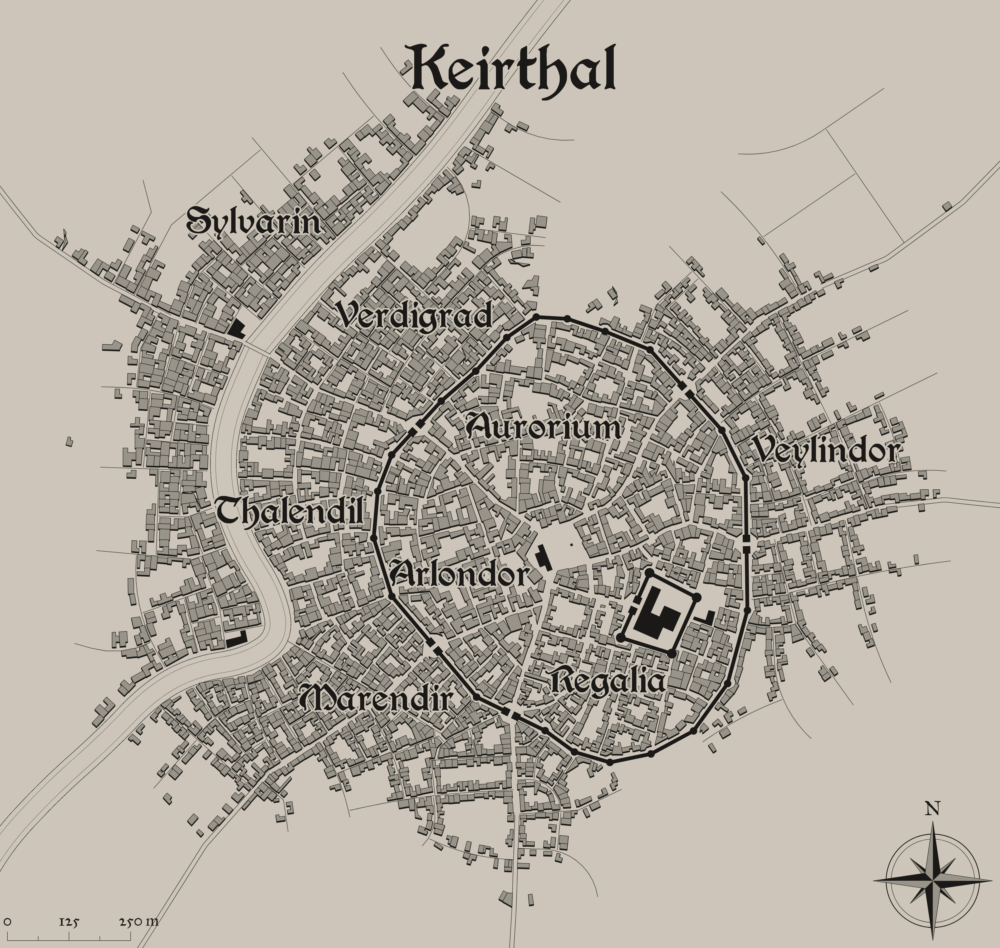

# Keirthal
  

In the heart of Verdantia, where the lush greenery meets the bustling hub of civilization, lies the vibrant city of Keirthal, jewel of the realm and seat of power for the verdant kingdom. Here, amidst the whispering leaves and winding streets, the spirit of the land thrives, interwoven with the bustling activity of daily life.

Keirthal is a city of contrasts, where ancient traditions blend seamlessly with modern innovation, and the past and present coexist in perfect harmony. Its streets are alive with the hustle and bustle of commerce, as merchants peddle their wares in bustling marketplaces and artisans ply their trade in workshops and studios.

At the heart of the city lies the majestic castle, a towering fortress of stone and wood that serves as the seat of power for the verdant monarchs. Here, amidst the grandeur of marble halls and gilded chambers, the rulers of Verdantia hold court, dispensing justice and guidance to their loyal subjects.

Surrounding the castle are the eight districts of Keirthal, each with its own unique character and charm. From the bustling markets of the Arlondor to the serene beauty of the Temples in Aurorium, Keirthal is a city of diverse cultures and vibrant communities, where people of all walks of life come together in a celebration of unity and diversity.

But amidst the hustle and bustle of city life, the natural beauty of Verdantia is never far away. Parks and gardens dot the landscape, their verdant greenery providing a welcome respite from the hustle and bustle of urban living. And beyond the city walls, the lush forests and rolling hills of the countryside beckon, offering endless opportunities for exploration and adventure.

In Keirthal, the spirit of Verdantia thrives, its essence woven into the very fabric of the city itself. It is a place of beauty and wonder, where the wonders of nature and the achievements of civilization come together in perfect harmony. And for those who call it home, Keirthal is more than just a city – it is a living testament to the enduring spirit of Verdantia and the boundless potential of the human spirit.