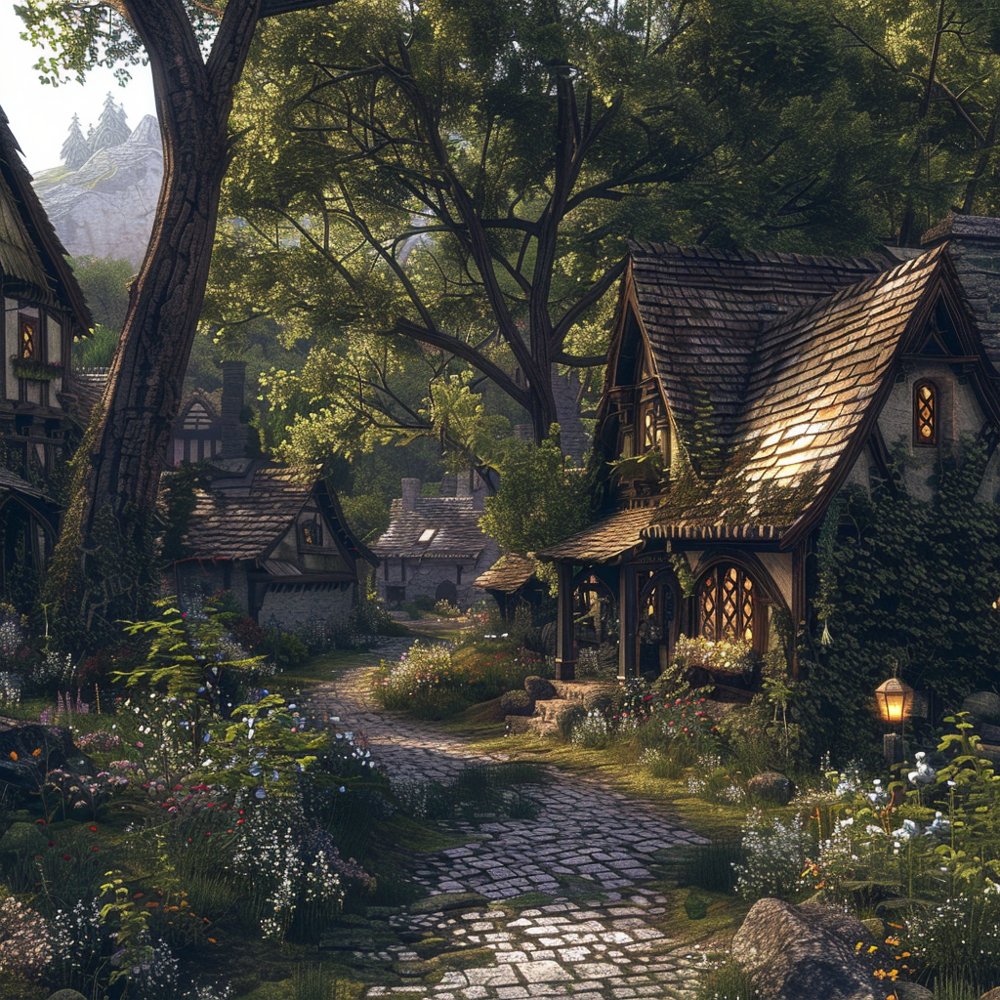

# Veyl Sylvari

Nestled at the edge of a vast, ancient forest, Veyl Sylvari exudes an aura of tranquility and natural beauty. The village is a picturesque haven, where quaint cottages with thatched roofs peek out from amidst a sea of emerald greenery. Tall, slender trees cast dappled shadows over cobblestone pathways, while wildflowers carpet the ground in a riot of color.

The air is filled with the sweet scent of pine and earth, mingling with the delicate fragrance of blooming flowers. Birds chirp melodiously in the treetops, their songs a soothing melody that echoes through the village. Sylvari Creek meanders gently through the outskirts of the settlement, its crystalline waters babbling softly as they wind their way towards the heart of the forest.

Despite its small size, Veyl Sylvari is a bustling hub of activity, where villagers go about their daily lives with a sense of harmony and purpose. The community is tightly knit, with neighbors greeting each other warmly as they go about their chores and errands. Children laugh and play in the village square, their carefree laughter a joyful symphony that fills the air.
