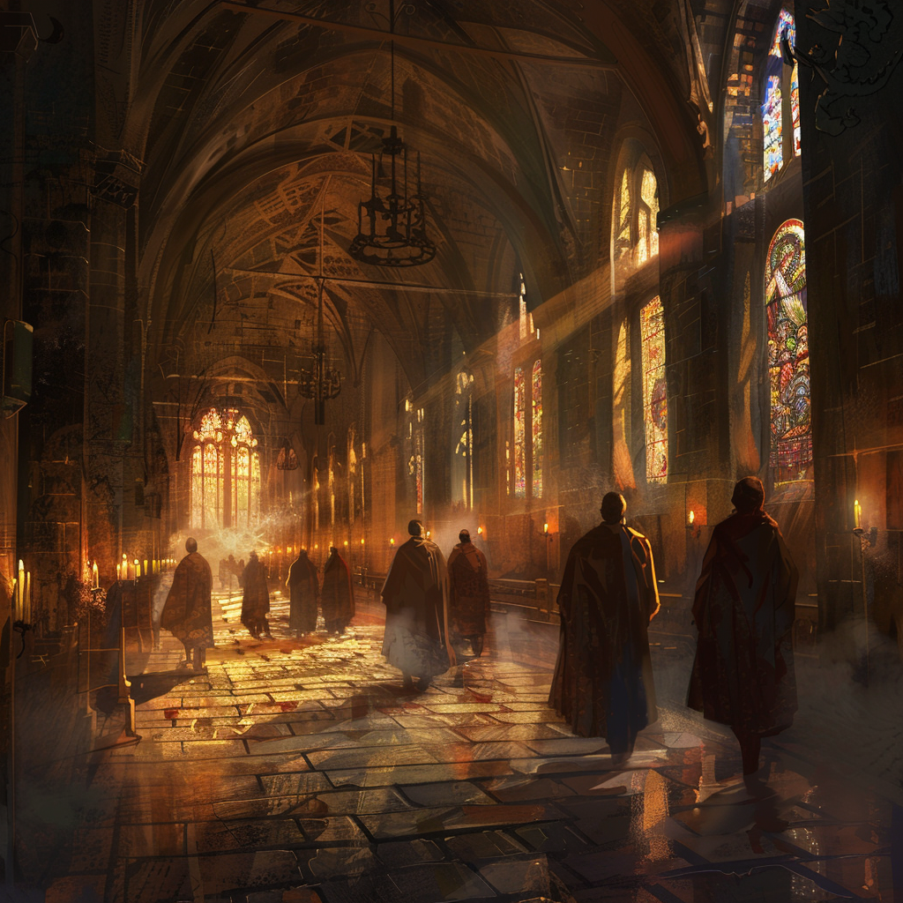

# Aurorium

Within the hallowed halls of Aurorium, monks move with quiet reverence through sunlit cloisters, their faces illuminated by flickering candlelight. Stained glass windows cast kaleidoscopic patterns on flagstone floors, and the sound of chanting echoes through vaulted ceilings. Seekers of truth and enlightenment come here to meditate and reflect.

**Back to [Keirthal](../_cities/Keirthal.md)**