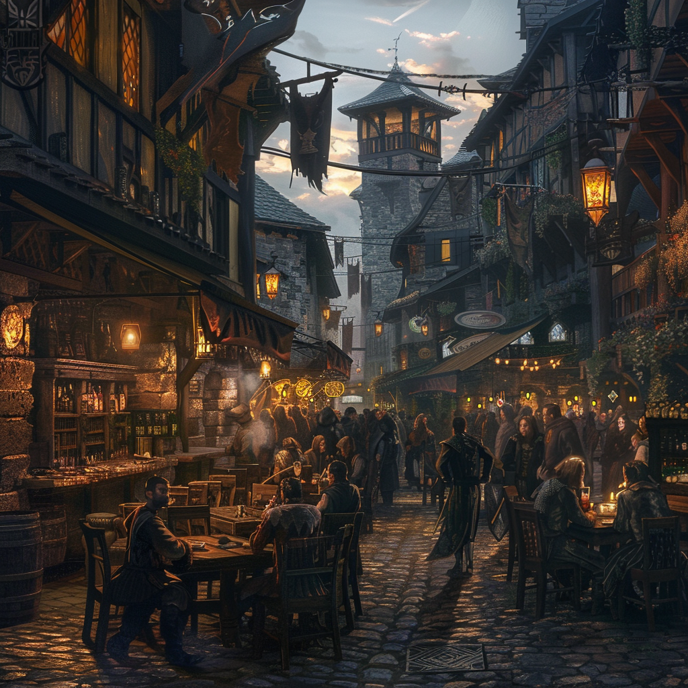

# Marendir

As the sun sets, Marendir comes alive with nightlife and revelry. Taverns overflow with patrons, and musicians ply their trade in crowded squares. Alleyways are lined with vendors selling everything from street food to trinkets and treasures. It's a place of celebration and camaraderie, where the joy of life is celebrated in all its forms.

**Back to [Keirthal](../_cities/Keirthal.md)**