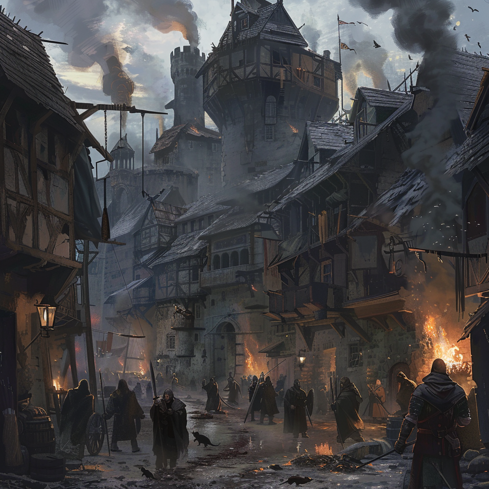

# Verdigrad

This fortified district crackles with the energy of a thousand marching boots and the clang of weapons being honed. Soldiers stand at attention as they prepare for battle, and banners bearing the Verdantian army's emblem flutter in the breeze. It's a bastion of strength and resilience, where warriors stand ready to defend their homeland.

**Back to [Keirthal](../_cities/Keirthal.md)**