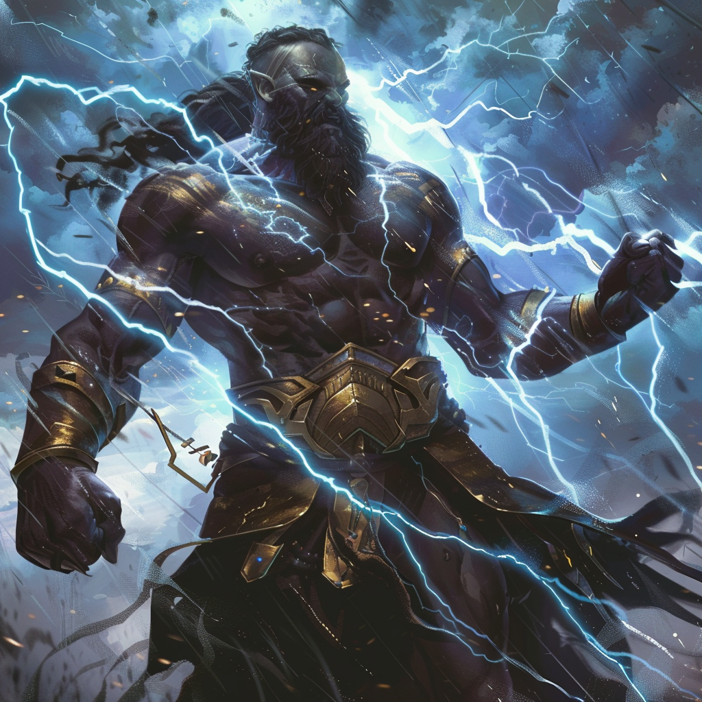

## Domain
**Tempest, War, and Strength**

## Appearance

Aeolus is a towering figure with rippling muscles, clad in storm clouds and wielding a crackling lightning bolt as a weapon. His eyes flash with the fury of a tempest, and his voice booms like thunder.

## Ascension

In the ancient annals of Mythara, there exists a legend of unparalleled valor and mastery over the elements—the ascension of Aeolus, the Storm Commander.

Once, Aeolus walked the mortal realm as a great general, his name whispered in awe by warriors and kings alike. Born beneath the tempestuous skies and the thundering clouds of the storm, he was a master of strategy and tactics, his cunning on the battlefield unmatched by any who dared to challenge him.

But it was not mere martial prowess that set Aeolus apart—it was his mastery over the elements themselves. From a young age, he had shown an uncanny affinity for the winds and storms, his command over the tempests of nature a sight to behold.

As the years passed, Aeolus led his armies to countless victories, his name becoming synonymous with glory and triumph. But deep within his heart, he harbored a longing for something more—a desire to transcend the mortal realm and ascend to heights undreamed of by even the mightiest of warriors.

And so, on the eve of his greatest battle, as the lightning danced across the sky and the winds howled with fury, Aeolus stood upon the precipice of destiny, his spirit aflame with determination and his eyes fixed upon the heavens above.

In a whirlwind of elemental power and divine energy, Aeolus ascended to the heavens. As the god of storms and the tempests, he became the master of the skies and the guardian of the natural order, his presence a force of nature to be reckoned with.

And though he had once been a mortal general, Aeolus's ascension was a testament to the indomitable will of the human spirit and the boundless power of the elements themselves.