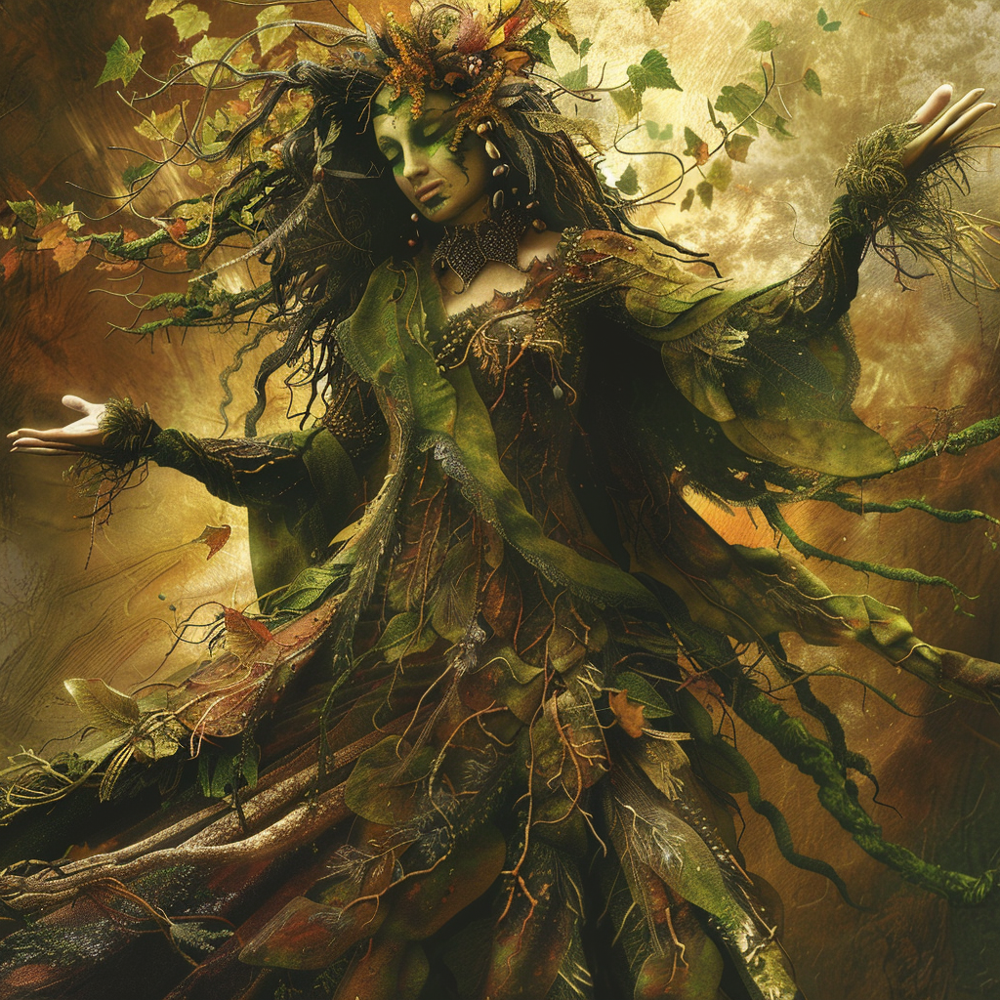

## Domains
**Earth, Growth, and Protection**

## Appearance 

Arboria is a nurturing presence, embodying the fertile soil and lush greenery of the land. She appears as a matronly figure with arms outstretched, offering shelter and sustenance to all living creatures. Her touch brings life to barren landscapes and strength to the weak.

## Ascension

In the primordial dawn of Mythara, when the world was but a canvas waiting to be painted with life's vibrant hues, Aurelia, the Sun Sovereign, gazed upon the nascent realm with tender affection. Moved by a desire to see the world flourish in all its splendor, she decreed that from the very essence of nature itself, two beings of boundless beauty and grace would emerge.

And so, from the verdant depths of the earth and the whispering breezes of the air, Sylvana and Arboria were born. Born not of mortal flesh, but of the divine essence of the world itself, they emerged as twin daughters of the natural order, their forms radiant with the majesty of creation.

Sylvana, born of the ancient trees and the rustling leaves, embodied the untamed spirit of the forests and woodlands. Her hair flowed like cascading waterfalls, and her eyes sparkled with the light of a thousand stars. She was the guardian of the wild places, her presence a testament to the raw beauty and vitality of the natural world.

Arboria, born of the fertile soil and life-giving rains, embodied the nurturing essence of all living things. Her skin glowed with the verdant hues of spring, and her voice carried the gentle murmur of new growth. She was the caretaker of all living beings, her touch bringing life and vitality to even the most barren of lands.

United in purpose and bound by their love for the world, Sylvana and Arboria watched over the land with a watchful eye, ensuring that the delicate balance of nature was maintained and that life flourished in all its myriad forms. And as the ages passed, their divine presence only grew stronger, their bond as sisters unbreakable and their dedication to their sacred duty unwavering. Thus began the age of the gods, with Sylvana and Arboria standing as the eternal guardians of life and the sacred stewards of the natural order, their very existence a testament to the divine decree of the Sun Sovereign.