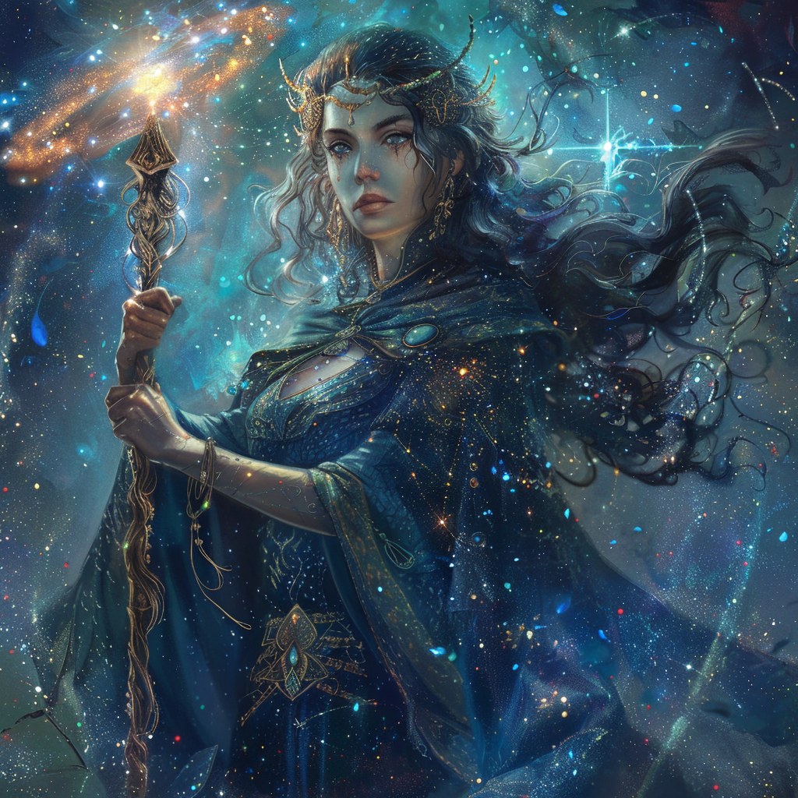

## Domain
**Magic, Knowledge, and Fate**

## Appearance

Astraia manifests as a celestial being adorned with swirling galaxies and twinkling stars. She holds a staff adorned with ancient runes and possesses eyes that seem to see into the depths of the cosmos.

## Ascension

In the annals of Mythara's ancient history, there exists a tale of unparalleled magic and celestial splendor—the ascension of Astraia, the Archmage of the Arcane.

From a young age, Astraia displayed an innate talent for the arcane arts, her mastery of magic surpassing even the most seasoned wizards of her time. Born beneath the twinkling stars and the shimmering auroras of the night sky, she was drawn to the mysteries of the cosmos, her thirst for knowledge and power driving her ever onward.

As the years passed, Astraia honed her skills with relentless dedication and unwavering determination, delving into the deepest recesses of magical theory and experimentation. Her brilliance knew no bounds, and soon she had surpassed even the most legendary mages of antiquity, her name whispered in reverence by all who knew of her prowess.

But it was not mere mastery of the arcane that set Astraia apart—it was her boundless ambition and unyielding spirit. For she dreamed not only of unlocking the secrets of magic, but of transcending the limitations of mortal existence itself, ascending to heights undreamed of by even the most powerful sorcerers.

And so, on the night of the celestial convergence, as the stars aligned in a cosmic symphony of light and energy, Astraia stood upon the precipice of destiny, her heart filled with determination and her spirit ablaze with the fire of her ambition.

In a blaze of ethereal light and crackling energy, Astraia ascended to the heavens, her mortal form suffused with the raw power of the cosmos itself. As the goddess of magic and knowledge, she became the custodian of arcane knowledge and the keeper of the celestial realms, her presence a beacon of hope and inspiration to all who sought to unlock the mysteries of the universe.

And though she had once been a mere mortal, Astraia's ascension was a testament to the indomitable spirit of the human soul and the boundless potential of magic itself.
