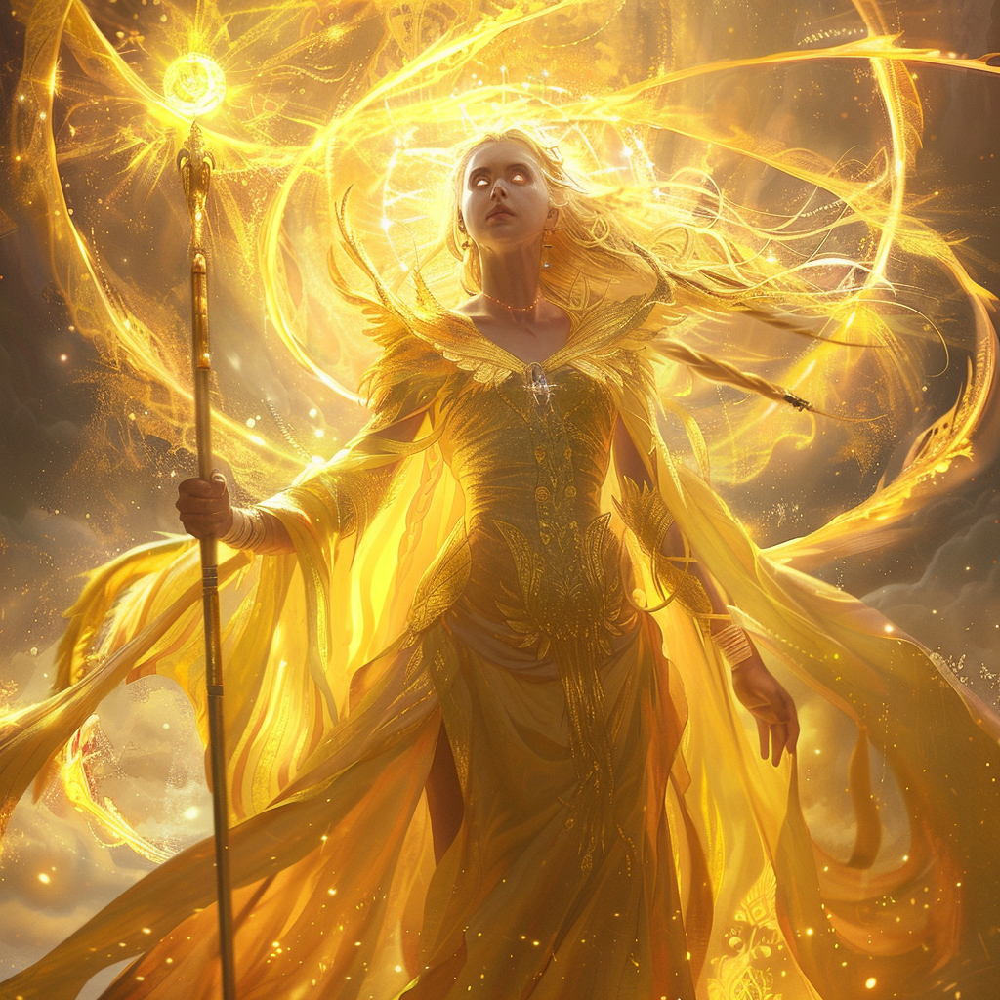

## Domain
**Light, Life, and Justice**

## Appearance

Aurelia appears as a radiant figure with golden hair and eyes that shimmer like the sun. She wears flowing robes of pure light and carries a gleaming staff that emits a warm, comforting glow.

## Ascension

In the dawn of Mythara, when the world was still young and the heavens whispered secrets untold, there arose a mortal of unparalleled beauty and grace. Her name was Aurelia, and she was destined for greatness.

Born of humble origins, Aurelia possessed a radiance that shone like the sun itself, her spirit untamed and her heart pure. She wandered the world with an insatiable curiosity, seeking to unravel the mysteries of existence and bask in the wonders of creation.

But it was not mere curiosity that drove Aurelia—it was a thirst for knowledge, a hunger for truth that burned like a flame in her soul. With each passing day, she delved deeper into the secrets of the cosmos, her intellect sharpened by the challenges she faced and the trials she endured.

And so, through sheer determination and unwavering resolve, Aurelia ascended to heights that no mortal had dared to dream. She transcended the boundaries of mortality, her mortal form suffused with the divine essence of the heavens themselves, becoming the first of the gods.

With her ascension, Aurelia became known as the Sun Sovereign, the bringer of light and life to all who dwelled beneath her radiant gaze. She watched over the world with a benevolent eye, guiding mortals along the path of righteousness and illuminating the darkness that lurked in the hearts of men.

And though she ascended to the heavens, Aurelia's presence remained etched upon the world, her legacy enduring for all eternity as a beacon of hope and inspiration to all who dared to dream of greatness. Thus began the age of the gods, with Aurelia standing as their shining example, the first among equals in the pantheon of Mythara

