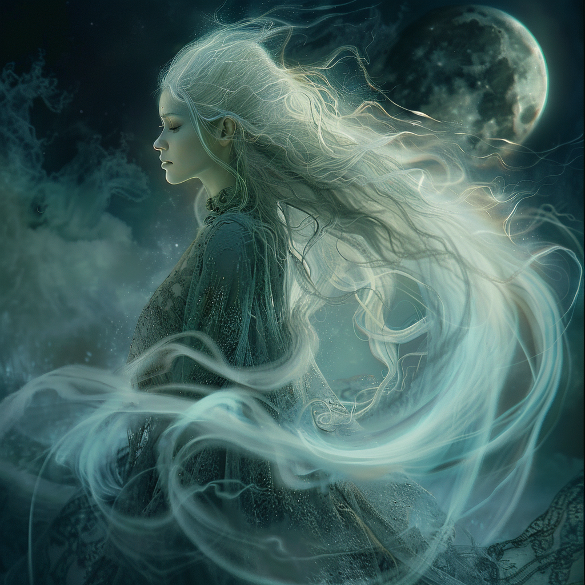

## Domains
**Moon, Dreams, and Illusion**

## Appearance 

Lysandra appears as a serene figure bathed in the soft glow of moonlight. Her hair cascades like silver threads, and her eyes hold the mysteries of the night sky. She weaves illusions and guides the dreams of mortals.

## Ascension
  
In the quietude of Mythara's nocturnal embrace, where the moon's silver light cast shimmering veils upon the land, there emerged a figure of ethereal beauty and enigmatic grace. She was Lysandra, the Night Whisperer, and her ascension to godhood was a tale woven from the threads of moonlight and shadow.

Born beneath the watchful gaze of the night sky, Lysandra was but a mere mortal, her youthful spirit ablaze with curiosity and wonder. From a tender age, she was drawn to the mysteries of the night, her heart stirred by the gentle murmur of the nocturnal winds and the soft caress of the moon's luminous glow.

But it was not mere fascination that drove Lysandra—it was a calling, a destiny written in the stars themselves. And so, on the eve of her fifteenth year, as the moon hung heavy in the heavens, she felt the stirrings of a power awakening within her, a power that would forever change the course of her destiny.

In a moment of transcendental clarity and radiant splendor, Lysandra ascended to the heavens, her mortal form bathed in the silvery radiance of the moon's embrace. As the goddess of the night, she became the keeper of dreams and the guardian of the nocturnal realm, her presence a soothing balm to those who walked the shadowed paths of the world.

Though she was but fifteen years of age, Lysandra's ascension was a testament to the boundless potential of youth and the enduring power of the night. And as she soared among the stars, her luminous form casting a radiant glow upon the land below, she knew that her journey had only just begun, her spirit forever bound to the celestial dance of the heavens.