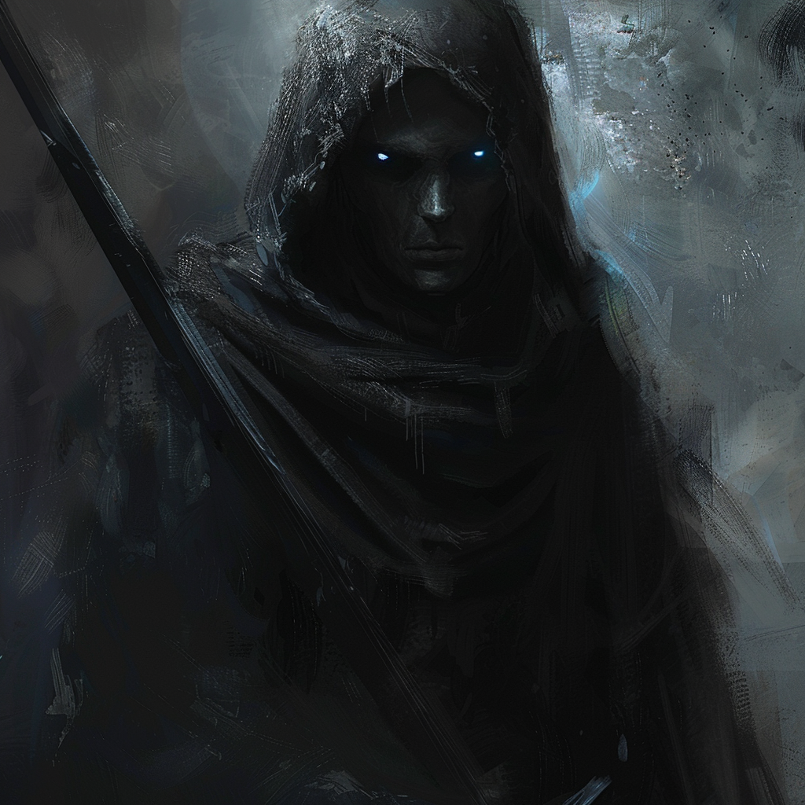

## Domains
**Death, Darkness, and Secrets**

## Appearance 

Mordecai appears as a cloaked figure with eyes that gleam like polished onyx. He moves silently through the shadows, wielding a scythe that cuts through the veil between life and death. His presence inspires both fear and reverence.

## Ascension

In the ancient annals of Mythara, whispered among mortals and gods alike, lies the tale of Mordecai's ascent—a story of cunning, betrayal, and the ruthless pursuit of power that led to his transformation into the god of death.

Once, Mordecai was known throughout the realms as a master thief, his skill and cunning unmatched by any who dared to challenge him. With each daring heist, he grew bolder and more audacious, his thirst for riches and glory driving him ever onward.

But it was not mere wealth that Mordecai sought—it was power. And so, in his relentless pursuit of dominance, he devised a scheme so audacious, so cunning, that it would forever alter the course of history.

Knowing that the gods themselves held the ultimate power in the world, Mordecai set his sights on the divine pantheon, seeking to outsmart them and claim their power for his own. With guile and deceit, he ensnared Aeolus in a web of lies and deception, tricking him into granting Mordecai the divine spark of godhood.

But the gods are not easily fooled, and when they discovered Mordecai's treachery, they cast him out of the heavens and into the shadows, condemning him to rule over the realm of death for all eternity.

Now, as the Shadow Reaper, Mordecai prowls the darkest corners of Mythara, his heart filled with bitterness and rage. Though his power is unmatched, he is cursed to dwell forever in the shadows, a reminder of the consequences of ambition and deceit.

